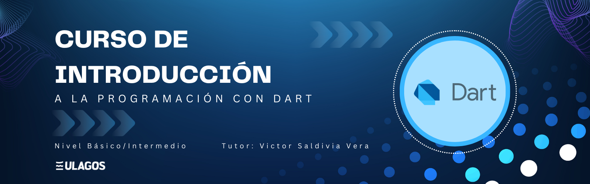

# Repositorio Nivel Básico Dart

   

## Descripción del Proyecto

Este repositorio contiene información para trabajar con Dart de nivel Básico desde cero. 
Incluye uso de variables, tipos de datos, funciones, condicionales y ciclos. 
Con el objetivo de conocer un poco más este grandioso lenguaje de programación

Con ejemplos de diferentes algoritmos, el aprendizaje será mas fácil aún.

En una segunda etapa se explicará la sección de Estructura de Datos utilizando Dart.

## Enlaces de Interés

- Web oficial de Dart [(Instalacion Dart)][dart]
- Visual Studio Code [(Editor de Texto)][vscode]

[dart]: https://dart.dev/get-dart
[vscode]: https://code.visualstudio.com/download
